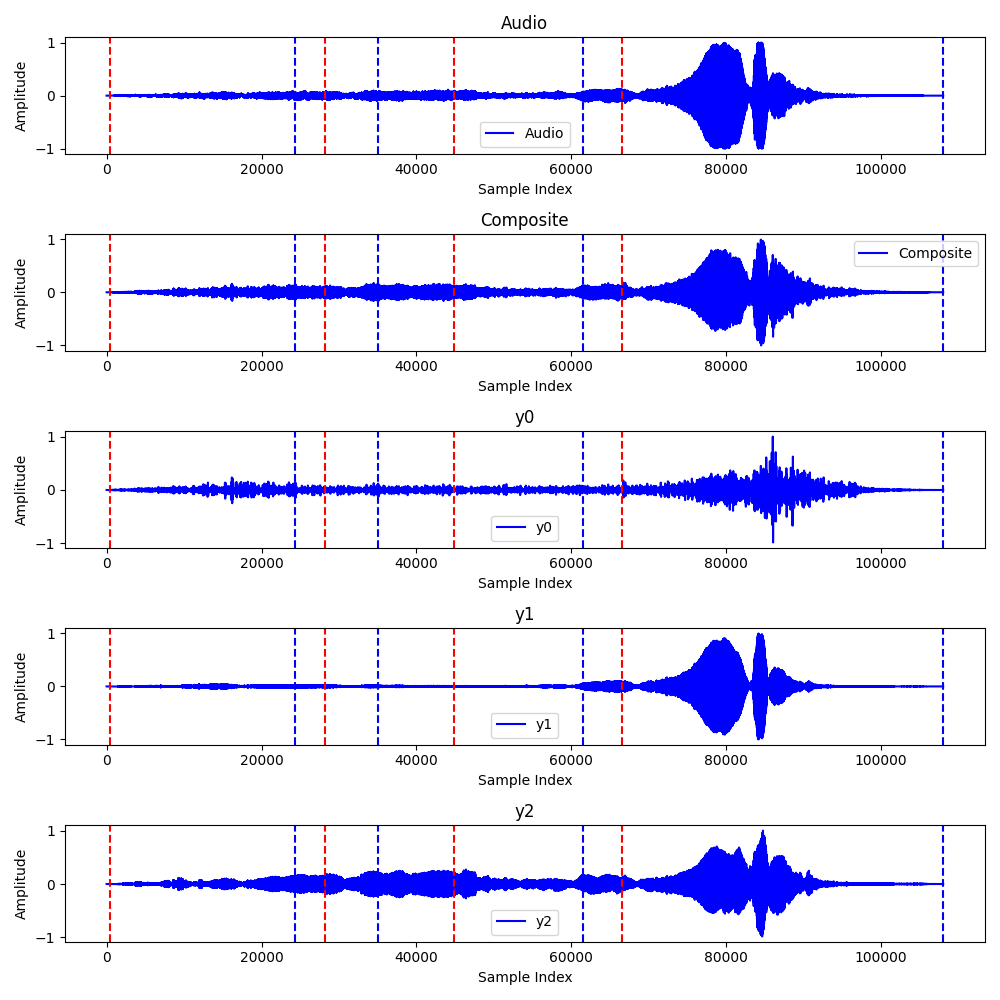
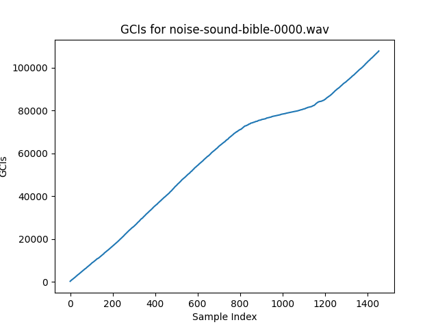

# Speech Understanding - Major Project

## Enhancing-Voice-Activity-Detection-in-Noisy-Environments

### We are doing Unsupervised Voice Activity Detection by Modeling Source and System Information using Zero Frequency Filtering. We investigate the potential of zero-frequency filtering for jointly modeling voice source and vocal tract system information, and proposes two approaches for Voice Activity Detection (VAD)

1. Demarcating voiced regions using a composite signal composed of different
   zero-frequency filtered signals.

2. Feeding the composite signal as input to the rVAD algorithm

## Dataset

The dataset used is Musan Dataset for noise.
[Dataset Link](http://www.openslr.org/17/)

## How to run the code

### Cloning the repo

    cd <path to clone the repo>

    git clone https://github.com/ayushabrol13/Enhancing-Voice-Activity-Detection-in-Noisy-Environments.git

### Changing directory to the cloned repo

    cd Enhancing-Voice-Activity-Detection-in-Noisy-Environments

### Creating a virtual environment

    pip install virtualenv

    virtualenv venv

    source venv/bin/activate

### Setting up the dependencies

    pip install -r requirements.txt

### Downloading the musan dataset

[Dataset Link](http://www.openslr.org/17/)

We are using the noise portion of the corpus.
It contains 932 recordings with a total time of 6 hours and 7 minutes.
It captures a wide variety of technical and non-technical noises that
cannot be considered speech or music. Some recordings feature an ambient
environment, e.g., walking through a city. The ambient sounds usually do
not feature any intelligible speech. Technical sounds include DTMF tones,
various cellphone noises (such as button presses or vibration),
dialtones and more. Non-technical sounds include thunder, lighting,
clapping, car horns, animal sounds, and more.

### Running the VAD

To run the complete code, run through the cells of ipynb notebook `main.ipynb`

## Results

All the results for the noisy dataset are available in the output directory which include the following:

1. Noisy Speech Signal with the predicted Decision Boundary.
2. Composite Signal with the predicted Decision Boundary.
3. (y0): Zero-frequency filtered Signal after Trend Removal with the predicted Decision Boundary with T0 cycle.
4. (y1): Zero-frequency filtered Signal after Trend Removal with the predicted Decision Boundary with T0/5 cycle.
5. (y2): Zero-frequency filtered Signal after Trend Removal with the predicted Decision Boundary with T0/10 cycle.

#### One Audio Sample Result

GCI Plot results are available in the gci_plots directory.

## Collaborators

    Ayush Abrol B20AI052
    Aryan Tiwari B20AI056
